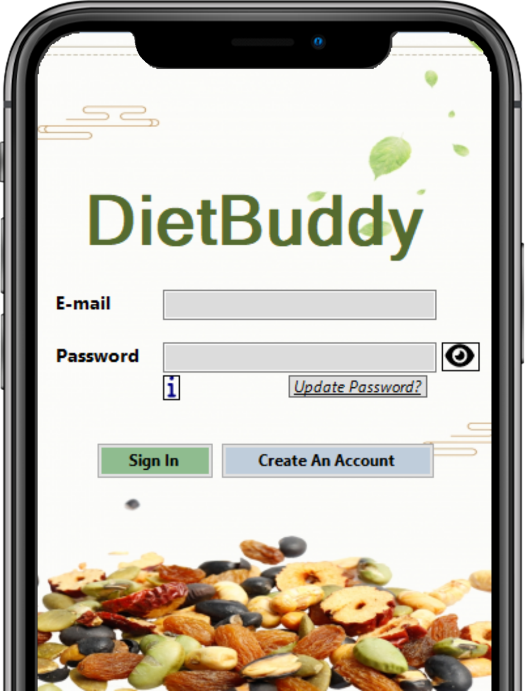
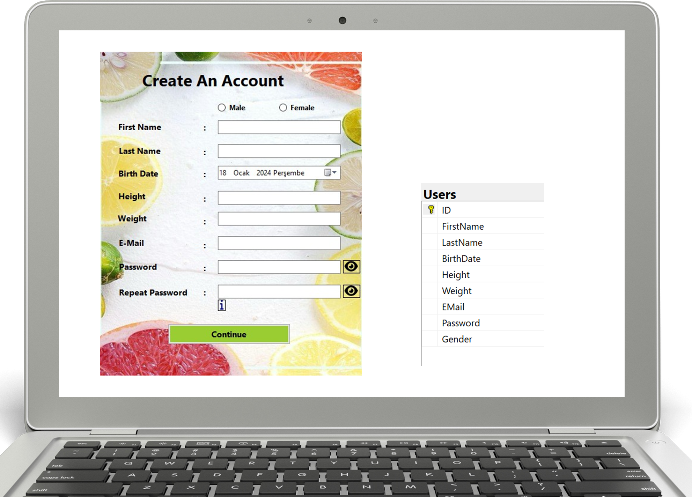
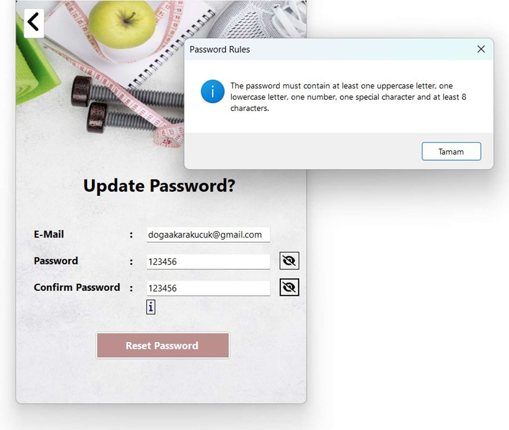
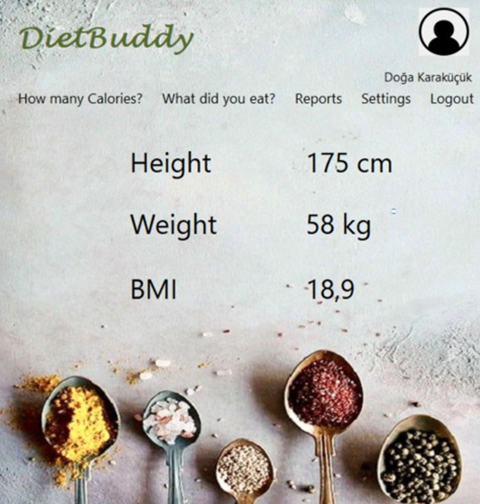
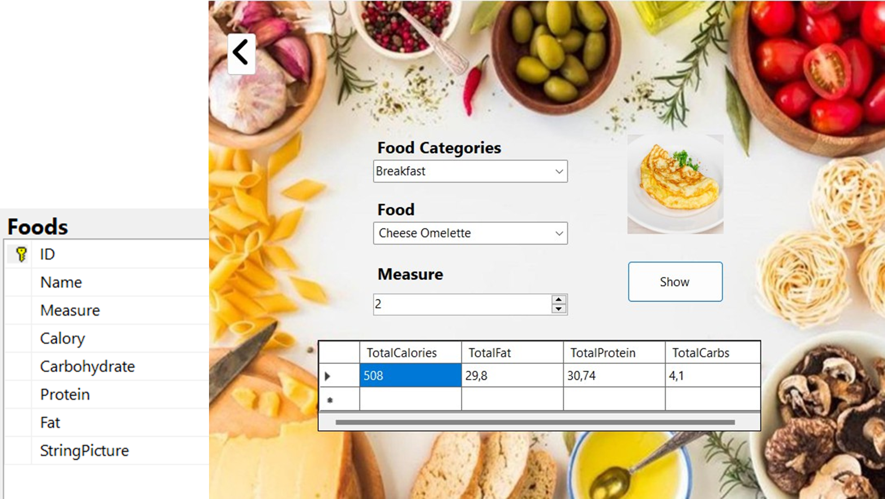
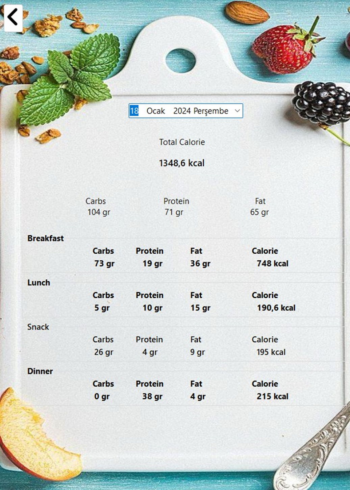
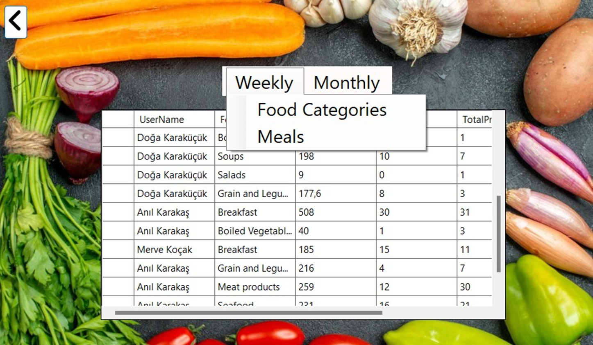
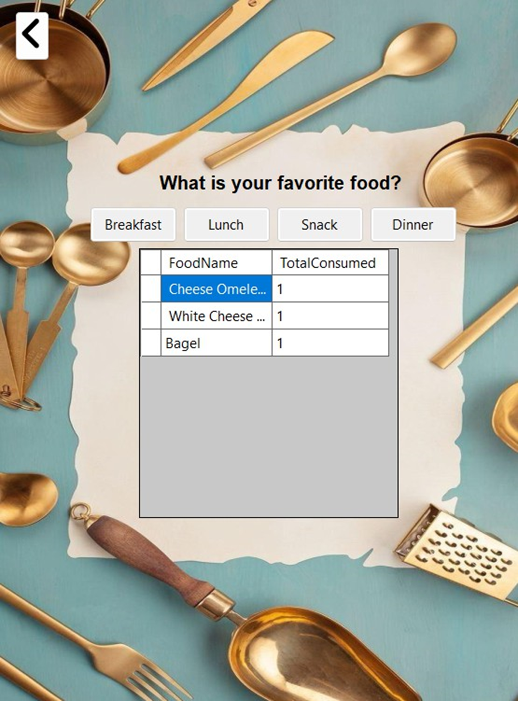
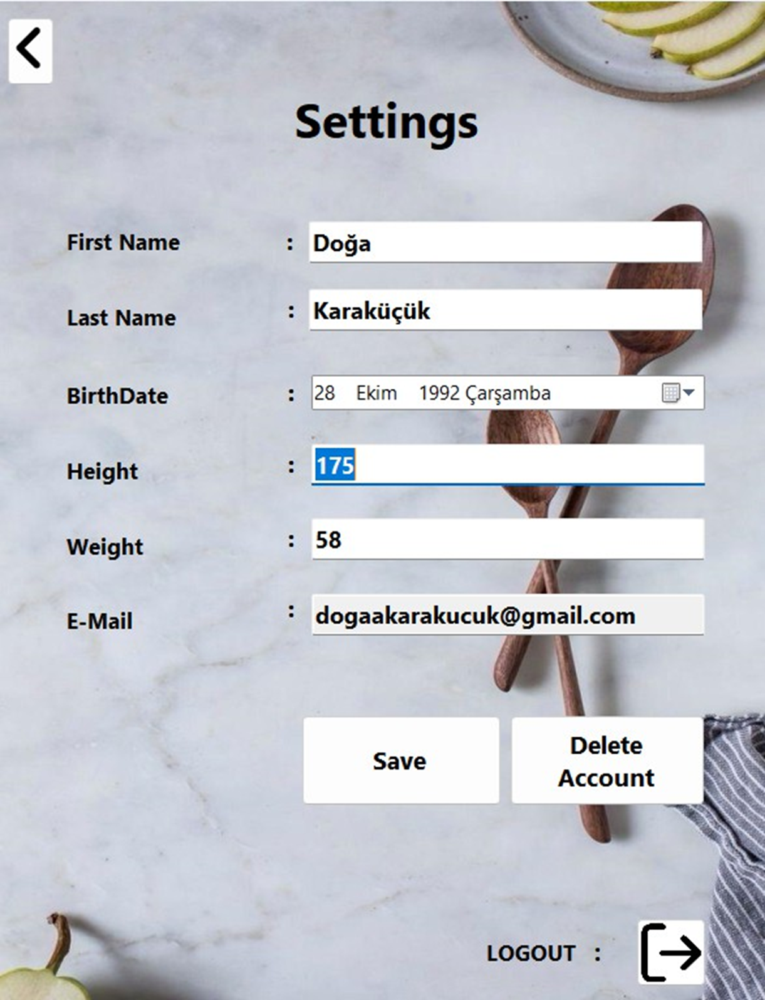

# MASAÜSTÜ DİYET UYGULAMASI 
Bu sunum, DietBuddy uygulamasının amacı ve kapsamını açıklamak üzere hazırlanmıştır.

# DİYET UYGULAMASININ AMAÇLARI
## - Kişiselleştirilebilir
Kullanıcının günlük, haftalık, aylık bazda ne kadar kalori aldığını öğün bazlı ve toplam olarak raporlama imkanı sunar.
Aynı zamanda diğer kullanıcılar ile öğün ve yemek kategorisi bazlı kıyaslama yapmaya olanak sağlar.
## - Takip ve Analiz
Günlük tüketilen kalori ve besin değerlerinin izlenebilmesini sağlar,
verileri analiz eder ve özetler. En çok tüketilen favori yiyeceklerin belirlenmesine yardımcı olur.
# UYGULAMANIN SAĞLADIĞI FAYDALAR
## 1-	Sağlıklı Beslenme Alışkanlıkları
Kullanıcıların uzun vadede sağlıklı beslenme alışkanlıkları kazanmalarına yardımcı olur.
## 2-	Kontrollü Kilo Alma Ve Verme
Kullanıcıların kilo alma ve verme süreçlerini etkili şekilde yönetmelerine yardımcı olur.
## 3-	Zindelik Ve Enerji
Sağlıklı beslenmeye uyumu arttırarak kullanıcıların günlük yaşam kalitelerini yükseltir.
# GİRİŞ VE ÜYELİK OLUŞTURMA
Uygulamaya girdiğimizde bizi karşılayan ekrandır.
Kullanıcılarımız bu ekran üzerinden yeni bir üyelik oluşturulabilir veya kayıtlı kullanıcı ise giriş yapabilir.

# ÜYELİK OLUŞTURMA
Kullanıcımız ‘Üyelik Oluşturma’ ekranında bilgilerini girerek uygulamaya kayıt olabilir. Tüm alanların eksiksiz doldurulması ve gerekli şartların yerine getirilmesi önemlidir. Gerekli şartların yerine getirilmemesi durumunda kullanıcıya uyarı verilmektedir.
Başarılı kayıt olma işlemi sonrasında kullanıcımız giriş ekranına yönlendirilmektedir.

# PAROLA YENİLEME
Kullanıcımız bu ekranda var olan parolasını yenileyebilir. Yeniden oluşturacağı parolası tıpkı üyelik oluşturma aşamasındaki kurallara tabi olacaktır. Yani kullanıcı parolası en az bir büyük harf, bir küçük harf, bir rakam, bir özel karakter ve en az 8 karakter içermelidir.

# ANA SAYFA
Kullanıcı ana sayfa üzerinden gün içerisinde yediği ürünlerin takibini yapabilir, merak ettiği yiyeceklerle ilgili karbonhidrat, protein, yağ ve kalori araştırması yapabilir. Aynı zamanda yine ana sayfa üzerinden raporlar bölümüne ve ayarlar bölümüne
ulaşabilir.

# KAÇ KALORİ
Kullanıcımız bu sayfada hangi besinin kaç porsiyonda kaç kalori olduğunu ve karbonhidrat, protein ve yağ oranlarının kaç gram olduğunu analiz edebilir.

# NE YEDİN?
Uygulamamızın bu sayfasında kullanıcımız gün içerisinde hangi öğünde, hangi besinden ne kadar yediğini seçerek bu besinlerin değerlerini hesaplatabilir. Sayfada bulunan ‘Ekle’, ‘Güncelle’ ve ‘Sil’ butonlarıyla seçtiği yiyecekler üzerinde
değişiklik yaparak öğünlerini güncelleyebilir.

# GÜN SONU RAPORU
Bu sayfada kullanıcımız günlük her öğünü için detaylı karbonhidrat, protein ve yağ alımını takip edebilir ve gün sonunda toplamda ne kadar kalori aldığını görebilir.

# KIYAS RAPORU
Programımızın bu ekranında kullanıcımız yediği öğünleri haftalık/aylık bazda diğer tüm program kullanıcıları ile öğün ve yemek kategorisi bazlı kıyaslayabilir.
Kıyas raporu sayesinde kullanıcımız diğer kullanıcıların verileri hakkında da bilgi sahibi olabilir.

# YEMEK ÇEŞİDİ RAPORU
Yemek çeşidi raporu hangi yemeklerin hangi öğünlerde ne kadar yediğini gösteren rapordur.
Bu raporda kullanıcımız kahvaltı, öğle yemeği, ara öğün ve akşam yemeğinde hangi yemeklerden ne kadar yediğini görebilir. Bu sayede en çok yediği favori yemeği hakkında bilgi sahibi olabilir.

# AYARLAR
Ayarlar sayfasından kullanıcımız programa üye olurken girdiği bilgilerini değiştirebilir.
Bu sayfada bulunan özellikle boy ve kilo bilgilerini güncelleyerek program kullanımı sırasında değişen vücut kütle endeksini(BMI) takip edebilir.
Aynı zamanda kullanıcımız programdaki üyeliğini de yine ayarlar bölümünden silebilir.

